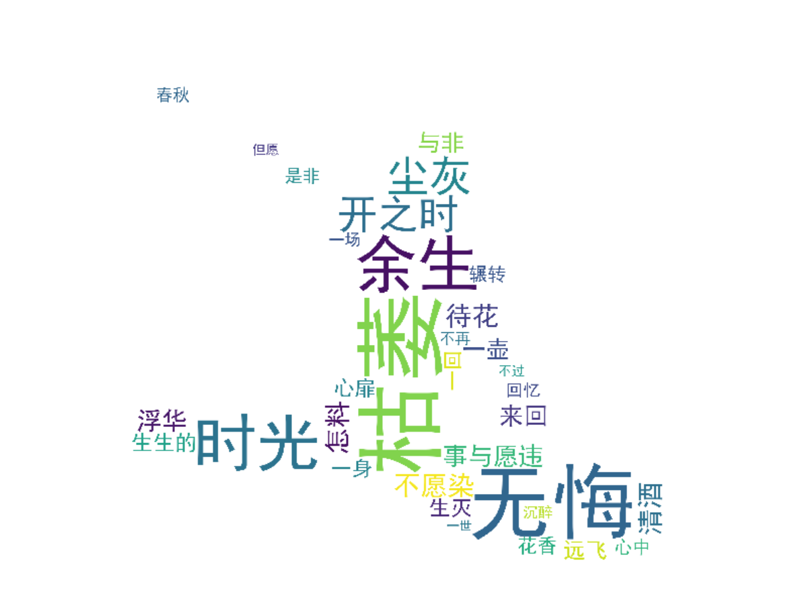

有机会介绍一些有趣的项目，向更多人甚至是非技术人员推广Python和人工智能的东西还是蛮有意义的。话不多说，本文将介绍如何将你喜欢的文章或者歌词做一个炫丽的词云图片。

什么是词云呢？简单来说就是，将提供的一段文本，根据关键词的出现频率而生成的一幅图像，人们只要扫一眼就能够明白文章主旨。今天我们用python来实现这样一个项目。如果成功，生成的结果会如下所示



## 生成中文词云的PYTHON步骤

需要你的电脑安装Python
接着利用pip工具安装需要的jieba、wordcloud、PIL模块
### 1.安装依赖
```
$ pip install jieba
$ pip install wordcloud
$ pip install PIL
```


### 2.添加想要用来生成文本的文章
小编蹭一波最近比较火的电视剧沉香蜜蜜烬如霜的热度，用主题曲歌词制作了一个文本，放在data目录下。Ok,DJ drop the beat
>回忆辗转来回 痛不过这心扉

>愿只愿余生无悔 随花香远飞

>一壶清酒 一身尘灰

>一念来回度余生无悔

>一场春秋 生生灭灭 浮华是非

>待花开之时再醉一回

>不愿染是与非 怎料事与愿违

>心中的花枯萎 时光它去不回

>回忆辗转来回 痛不过这心扉


### 3.选择生成词云的形状

Hold，现在要找一张图片，用它来定义你最后生成的词云形状。ok，我找来了一张打碟的DJ的图片放在根目录下。

### 4.代码部分
#### a)用jieba成词和权重的字典
```

def tokenize_content(content):
    jieba.analyse.set_stop_words("data/stop_words.txt")
    tags = jieba.analyse.extract_tags(content, topK=50, withWeight=True)
    word_tokens_rank = dict()
    for tag in tags:
        word_tokens_rank[tag[0]] = tag[1]
    return word_tokens_rank
```
&nbsp; 第一步还是去掉一些停用词，例如口语词汇或者意义不大的词，停用词可以自定义，在data目录下的stop_words.txt中。

&nbsp; 第二步 按照权重抽取前50个词，并转换成词典的形式。
#### b)用上面的生成的字典，传入word_cloud生成最后的效果
```
def generate_wordcloud(tags, mask):
    word_cloud = WordCloud(width=512, height=512, random_state=10, background_color='white', font_path=font,stopwords=STOPWORDS, mask=mask)

    word_cloud.generate_from_frequencies(tags)
    plt.figure(figsize=(10, 8), facecolor='white', edgecolor='blue')
    plt.imshow(word_cloud)
    plt.axis('off')
    plt.tight_layout(pad=0)
    plt.show()
```

注意如果使用的是苹果电脑，macOSX系统。需要添加

	import matplotlib
    matplotlib.use('TkAgg')


#### 注意的事项：
1：注意如果使用的是苹果电脑，macOSX系统。需要在引包的时候添加
```
import matplotlib
matplotlib.use('TkAgg')
```

2：如果是windows系统中，需要找到具体的中文字体，并定义下中文字体路径，例如如下。
```
font = r'C:\Windows\Fonts\simhei.ttf'
```


## 结论

感谢您花时间阅读这篇文章。希望这样有趣的项目，能让你对编程或者Pyhon产生更多的兴趣。下期见